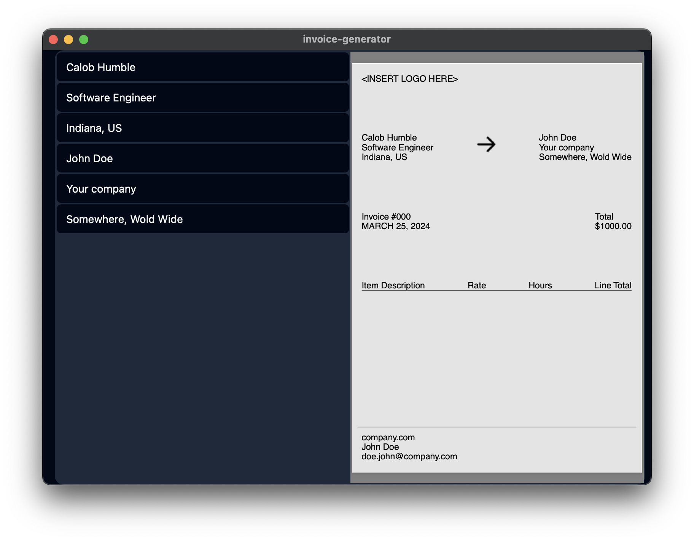

# Invoice Generation Dmeo

This is just a quick demo to show how to create PDFs on-demand, with preview.  Built on React, Tailwind, Shacn/UI, Zustand, and Tauri.

## Screenshot

## Requirements

You need to install Rust ([instructions](https://www.rust-lang.org/tools/install)) & Bun ([instructions](https://bun.sh/docs/installation))

## How to use

Just clone the respositoy, and run `bun tauri dev` to get a development version running on your machine.